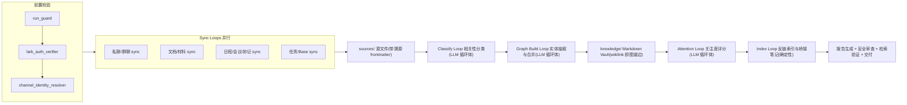

# Daily Memory Skill

`daily-memory-skill` 是一个面向 OpenClaw、Hermes Agent、Codex 及其他智能体平台的个人工作记忆技能。它的目标不是生成普通日报，而是把每天授权范围内的飞书/Lark 私聊、群聊、文档、材料、日程、会议、会议妙记、任务/Base 等信息，整理成可追溯、可更新、可检索的个人知识图谱(Obsidian 兼容的 Markdown vault)，并把需要关注的事件、风险、进展和闭环状态汇总给用户。

整体实现采用 **loop engineering** 设计(参考 [rowboat](https://github.com/rowboatlabs/rowboat) 的知识图谱流水线)：每个处理阶段是一个小型、幂等、有状态的循环，由确定性引擎 `tools/memoryctl` 驱动；LLM(宿主 agent)只在循环体内做判断。

运行时入口是 [SKILL.md](SKILL.md)。本 README 面向人类维护者和自动化安装器，用于理解架构、配置、使用方式和稳定运行注意事项。

## 核心目标

- 构建个人长期项目记忆，而不是一次性的日报摘要。
- 以事件为中心沉淀目标、相关人、时间线、进展、结果、风险、决策、任务和闭环状态。
- 保留每条记忆的证据来源、权限边界、时间戳和可信度。
- 支持 main agent 通过原生 memory search 查询 Daily Memory 的积累。
- 用增量循环代替一次性大批处理：成本随当日增量而非历史规模扩张，任何中断都可断点恢复。

## 架构设计



每个 loop 遵循同一骨架：`scan(增量检测) → take batch(小批量) → process(循环体) → write → commit(持久化状态)`。引擎用 mtime+hash 双重校验做增量检测，每批提交后立即落盘状态；`memoryctl run` 在第一个仍有待处理工作的 LLM loop 处停下并输出 `next_action`，agent 处理该批并 commit 后再次调用，直到 `done`。详见 [references/loop-engineering.md](references/loop-engineering.md) 与 [tools/README.md](tools/README.md)。

主 agent 只做编排、循环体执行(或委派给短生命周期 subagent)和最终报告。采集由并行 sync worker 完成；分类、建图、关注度由 loop body worker 按批完成；索引与桥接笔记由引擎确定性生成。

## 目录结构

```text
daily-memory-skill/
  SKILL.md
  README.md
  install.sh                # 插件式一键安装器(openclaw/hermes)
  agents/
    openai.yaml
  assets/
    config.example.yaml
  prompts/                  # LLM 循环体提示词
    classify_source.md
    note_creation.md
    attention.md
  tools/                    # 确定性循环引擎(Python 3, 零依赖)
    memoryctl.py
    memoryctl/
    tests/
  references/
    loop-engineering.md
    agent-installation.md
    openclaw-auto-install.md
    hermes-auto-install.md
    lark-cli-ingestion.md
    memory-adapters.md
    safety-quality.md
    schemas.md
    subagent-workflow.md
```

运行工作区(`memoryctl init` 创建，例如 OpenClaw)：

```text
~/.openclaw/workspace-daily-memory/
  MEMORY.md
  sources/<family>/YYYY-MM-DD__<id>.md   # 同步的原始证据
  knowledge/                              # 知识图谱 vault(Obsidian 兼容)
    Events/  People/  Organizations/  Projects/  Topics/  Daily/
    daily-memory-YYYY-MM-DD.md            # 引擎生成的桥接笔记
  state/                                  # loop 状态与批次工作单
  index/edges.json                        # 派生的 wikilink 边索引
  runs/YYYY-MM-DD/run_manifest.yaml
  reports/YYYY-MM-DD.md
```

`knowledge/` 既是事实源也是检索面：每个实体一个带 frontmatter 的 Markdown 笔记，`[[wikilink]]` 即图谱边；`index/edges.json` 由引擎从 wikilink 确定性重建。

## 记忆模型

Daily Memory 使用多层记忆：

- **Raw evidence**(`sources/`)：原始消息、文档导出、会议记录的 Markdown 快照，frontmatter 保留溯源信息。只作为证据，不直接进入长期记忆。
- **Loop state**(`state/`)：每个 loop 的已处理文件清单(mtime+hash)与批次工作单，引擎管理。
- **Run ledger**(`runs/`)：每次运行的 manifest、auth 证明、sync 状态、loop 统计、交付状态。
- **Knowledge vault**(`knowledge/`)：事件、人物、组织、项目、主题笔记 + 每日 episodic 笔记，是事实源。
- **Bridge note**(`knowledge/daily-memory-*.md`)：`memoryctl index` 确定性生成的紧凑摘要，供浅层检索。
- **Native long-term memory**(`MEMORY.md`)：只保存高置信、长期有用、可复用的规则和偏好。

## 安装方式

### 一键安装(推荐)

仓库根目录提供插件式安装器 [install.sh](install.sh)，效果等同于 `/plugin install daily-memory-skill`：

```bash
# 在已 checkout 的仓库内，自动检测 OpenClaw / Hermes 并全部安装
./install.sh install

# 只装某个平台
./install.sh install openclaw
./install.sh install hermes

# 无 checkout 的远程一键安装(自动 git clone 到共享目录)
curl -fsSL https://raw.githubusercontent.com/junwayne66/daily-memory-skill/main/install.sh | bash -s -- install

# 查看安装状态 / 更新 / 卸载(保留数据)
./install.sh status
./install.sh update
./install.sh uninstall
```

安装器做的事情：

1. 把 skill 同步成**一份 canonical 副本**(默认 `/workspace/share-skills/daily-memory-skill`，无 `/workspace` 时退回 `~/.agents/skills/`)。
2. 为每个平台建立 symlink：`~/.openclaw/skills/daily-memory-skill` 和 `~/.hermes/skills/daily-memory-skill` 都指向 canonical 副本，一次 `update` 全平台生效。
3. 用 `memoryctl init` 初始化各平台工作区(OpenClaw: `~/.openclaw/workspace-daily-memory`；Hermes: `~/.hermes/daily-memory`)，写入 `AGENTS.md`/`MEMORY.md` bootstrap(仅缺失时)。
4. 自动校验 symlink、工作区与引擎可用性，输出后续手工步骤(agent 注册、extraPaths、cron)。

路径可用 `--share-dir`、`--openclaw-home`、`--hermes-home` 覆盖，或设置 `DAILY_MEMORY_SHARE_DIR`、`OPENCLAW_HOME`、`HERMES_HOME` 环境变量。

### 手工/定制安装

细节见 [references/agent-installation.md](references/agent-installation.md)。平台细节见：

- [references/openclaw-auto-install.md](references/openclaw-auto-install.md)：OpenClaw 安装、daily-memory agent、Feishu channel、cron、main agent memory 检索验证。
- [references/hermes-auto-install.md](references/hermes-auto-install.md)：Hermes 安装、外部 Daily Memory 根目录、Hermes native memory 指针、调度与 subagent 编排。

安装后目录结构：

```text
/workspace/share-skills/daily-memory-skill/        # canonical 副本
~/.openclaw/skills/daily-memory-skill -> canonical
~/.hermes/skills/daily-memory-skill   -> canonical
~/.openclaw/workspace-daily-memory/                # OpenClaw 工作区
~/.hermes/daily-memory/                            # Hermes 工作区
```

OpenClaw 推荐配置：

- 新建 `daily-memory` agent，workspace 指向 `~/.openclaw/workspace-daily-memory`。
- main agent 通过 `memorySearch.extraPaths` 读取 Daily Memory 的 `knowledge/` 目录。
- 每晚 `22:00 Asia/Shanghai` 触发 `daily-memory` agent。
- 飞书 channel 的密钥放入 `~/.openclaw/.env`，不要写死在 `openclaw.json`。

## 基础配置

参考 [assets/config.example.yaml](assets/config.example.yaml)。关键配置项：

- `run.schedule`：默认 `0 22 * * *`
- `run.stability.require_lark_auth_verifier`：真实采集前验证 lark-cli 授权
- `run.stability.require_channel_identity_resolver`：发送前解析当前 bot 的 owner peer
- `loops.steps`：流水线顺序，默认 `[classify, graph, attention, index]`
- `loops.batch_size`：每批处理的文件数，默认 25(长转录可调小)
- `loops.index.attention_threshold`：进入桥接笔记 Top Attention 的分数阈值
- `memory.verify_reader_search_after_write`：写入后验证 main agent 是否能检索
- `lark.auth_policy.never_login_when_user_token_ready`：user token 可用时禁止误触发重新登录
- `report.delivery.mode`：`file`、`feishu_doc`、`feishu_private_message` 或 `both`

## 使用方式

### 定时运行

在 OpenClaw 中创建 cron job，让 `daily-memory` agent 每天 22:00 执行：

```text
Use $daily-memory-skill to run the Daily Memory nightly archive.
Window: current local date from 00:00 to now.
Timezone: Asia/Shanghai.
Canonical workspace: /home/botinkit/.openclaw/workspace-daily-memory.
```

cron payload 应明确要求：

- 先执行 `run_guard`
- 再执行 `lark_auth_verifier`
- 再执行 `channel_identity_resolver`
- 之后才允许 sync loop 并行采集到 `sources/`
- 然后用 `memoryctl run --steps classify,graph,attention,index` 排空流水线(逐批处理并 commit)
- 写入后必须执行 `memory_index_verifier`

### 手动全量回灌

适合首次构建历史知识图谱：

```text
Use $daily-memory-skill to run a historical backfill before 2026-06-10.
Use authorized Feishu/Lark private chats, group chats, calendar, meetings, minutes, docs, materials, tasks/Base when configured.
Sync the historical window into sources/, then drain the loop pipeline batch by batch.
Verify main memory search after indexing.
```

回灌不需要特殊模式：sync loop 把历史窗口写入 `sources/` 后，同一条增量流水线会按批排空积压(状态逐批落盘，可随时中断续跑)。sync 分片建议：

- 消息按 chat 分片。
- 日程按月或季度分片。
- 文档按 token 分片。
- 会议/妙记按时间窗口分片。

### 查询支持

main agent 回答用户问题时，应优先检索 `knowledge/` vault 中的实体笔记和桥接笔记，而不是直接读取原始私聊全文。只有当用户明确要求追溯证据时，才顺着笔记的 `source_refs` 回到 `sources/` 下的源文件。

## 飞书/Lark 接入

Daily Memory 默认使用 `lark-cli`：

```bash
lark-cli config strict-mode
lark-cli auth status
lark-cli im +chat-list --as user --types p2p --page-size 3 --format json
lark-cli calendar +agenda --as user --start "$START_ISO" --end "$END_ISO" --format json
```

规则：

- 私聊、个人日程、用户可见文档、用户参与的会议优先使用 `--as user`。
- bot 可见群、bot 发送 owner report 可使用 `--as bot`。
- 如果 `strict-mode` 为 `off`，且 user auth 为 `ready` 或 `needs_refresh`，不要执行 `lark-cli auth login`。
- 每个真实采集 run 必须把 auth 检查结果写入 manifest。
- CLI flag 不确定时先跑 `--help`，不要凭记忆调用。

## OpenClaw Feishu Channel 绑定

OpenClaw 发送 owner report 时，应使用当前 Feishu channel 目录解析出来的 peer：

```bash
openclaw channels status --json
openclaw directory peers list --channel feishu --json
openclaw message send --channel feishu --target "$OPENCLAW_DIRECTORY_PEER_ID" --message "$TEXT" --json
```

不要复用：

- 旧 bot 的 `open_id`
- 其他 app 下拿到的 `open_id`
- 未验证的 `lark-cli` recipient id
- `openclaw.json` 里历史遗留的 binding id

如果出现 cross-app recipient 错误，应重新解析目录 peer，更新 main binding 和 owner allowlist，再重试一次。

### 飞书回复格式建议

如果需要通过 API、`lark-cli im +chat-messages-list`、消息搜索或后续 Daily Memory 回灌稳定读取 bot 回复，建议 OpenClaw Feishu channel 使用普通 `post`/raw 输出，而不是 streaming interactive card：

```json5
{
  channels: {
    feishu: {
      renderMode: "raw",
      streaming: false,
      accounts: {
        default: {
          renderMode: "raw",
          streaming: false
        }
      }
    }
  }
}
```

Streaming 卡片适合实时 UI 体验，但部分 API/CLI 回读只会返回片段或卡片兼容提示，不适合作为可审计交付证据。

## 稳定性策略

- 每次运行都有唯一 `run_id`、窗口和配置 hash；loop 状态文件让重复运行天然变成 no-op。
- 增量检测用 mtime+hash 双重校验：只改 mtime 不改内容的文件会被跳过。
- 每批提交后立即持久化状态，中断最多损失一个在途批次，scan 会原样重发。
- pending 批次之间不会出现同一文件，杜绝重复处理。
- 每个 sync worker 最多重试三次；大范围查询失败时进行确定性分片。
- 单个文档、会议或附件超时不能拖垮整次运行。
- 写 vault 时只追加或生成 `## Conflicts`，不静默覆盖旧事实；graph/attention 的 commit 先过 schema 校验。
- 发送前必须经过安全质量审查。
- 第三方通知、Base/任务写回默认禁止，必须用户确认。

## 交付内容

一次成功运行至少应产出：

- `runs/<date>/run_manifest.yaml`(含 loop 统计)
- `sources/<family>/...` 源文件(带 relevance 标注)
- `knowledge/` vault 笔记更新(Events/People/Projects/...)
- `knowledge/Daily/<date>.md` 每日笔记
- `knowledge/daily-memory-<date>.md` 桥接笔记(引擎生成)
- `index/edges.json` 边索引(引擎生成)
- `reports/<date>.md`
- 可选：飞书文档、飞书私聊摘要

最终报告应包含：

- 新增/更新/关闭事件
- 事件目标、相关人、开始时间、截止时间
- 进展过程、结果、闭环状态
- 风险、阻塞、待确认问题
- 需要用户关注的事项
- 数据源缺口和低置信项
- memory index/search 验证结果

## 验证清单

安装或升级后建议验证：

```bash
openclaw config validate
openclaw skills info daily-memory-skill --agent daily-memory
openclaw skills check --agent daily-memory
openclaw channels status --json
openclaw directory peers list --channel feishu --json
lark-cli config strict-mode
lark-cli auth status
openclaw memory index --agent daily-memory --force
openclaw memory index --agent main --force
openclaw memory search --agent main "Daily Memory" --max-results 5 --json
```

对 OpenClaw，不能只看 index 命令成功。必须确认 `memory search --agent main` 能命中 `memory/*.md` bridge note。

## 已验证端到端链路

最近一次真实 E2E 验证路径：

1. 飞书用户在当前 bot 私聊发送 `MSR的工作原理`。
2. OpenClaw Feishu gateway 收到消息并路由到 main agent。
3. main agent 调用 `memory_search`，命中 Daily Memory 的桥接记忆(该链路验证时位于 `memory/daily-memory-msr-work-principle.md`；当前架构下为 `knowledge/daily-memory-<date>.md`)。
4. main agent 调用 `memory_get` 读取桥接记忆全文。
5. main agent 生成带 `Source: Daily Memory Bridge - MSR 工作原理` 的回答。
6. Feishu channel 以普通 `post` 消息发送给用户，并可通过 `lark-cli im +chat-messages-list` 完整回读。

这条链路验证了：

- 新 Feishu bot 绑定成功。
- Feishu channel 可路由到 main agent。
- main agent 可检索 Daily Memory 记忆。
- 检索结果可拼接进最终回答。
- Feishu channel 可把完整内容发送给用户。

## 维护建议

- 保持 `SKILL.md` 精简，把 loop 协议、平台安装、schema 和安全策略放在 `references/`，把循环体提示词放在 `prompts/`。
- OpenClaw 和 Hermes 共用一个 canonical skill copy(含 `tools/` 引擎)，避免多份 skill 漂移。
- `knowledge/` vault 是事实源，native memory 只保存指针和高置信长期规则；`state/` 与 `index/` 是引擎派生数据，不要手工编辑。
- 修改引擎后运行 `cd tools && python3 -m pytest tests/` 验证增量检测与断点恢复行为。
- OpenClaw main agent 读取 Daily Memory 时，优先用 `memorySearch.extraPaths` 指向 `knowledge/`，不要为了共享记忆把 main workspace 和 daily-memory workspace 合并。
- 每次变更 Feishu bot/app 后，必须重新解析 active channel peer 并跑一次 owner-only E2E。
- 每次变更 memory provider/embedding 配置后，必须强制重建 daily-memory 与 reader agent 的索引，并用 reader agent 查询验证。

## 注意事项

- 这套系统会处理敏感的个人工作数据，必须遵守最小权限和授权边界。
- 原始私聊、群聊、会议记录不应直接写进长期 memory 或 owner report。
- 报告只面向 owner。第三方通知和任务/Base 写回默认禁止。
- 飞书应用切换后，旧 `open_id` 可能跨 app 失效，必须重新解析 OpenClaw directory peer。
- `lark-cli` 的命令和 flag 可能随版本变化，真实运行前要用 `--help` 发现。
- Hermes 内置 memory 较小，不适合存原始证据；应写 pointer 或紧凑摘要。
- OpenClaw main agent 若要读取 Daily Memory，必须配置 `memorySearch.extraPaths` 并重建索引。
- 如果搜索返回空、metadata missing、provider pending 等状态，要记录为平台检索问题，不要宣称记忆可检索。

## 参考文档

- [SKILL.md](SKILL.md)：技能运行时入口。
- [references/loop-engineering.md](references/loop-engineering.md)：loop 骨架、批次协议、状态文件、断点恢复。
- [tools/README.md](tools/README.md)：memoryctl 循环引擎命令与行为。
- [prompts/](prompts/)：classify/graph/attention 循环体提示词。
- [references/agent-installation.md](references/agent-installation.md)：跨平台代理人自动安装总 runbook。
- [references/openclaw-auto-install.md](references/openclaw-auto-install.md)：OpenClaw 自动安装指导。
- [references/hermes-auto-install.md](references/hermes-auto-install.md)：Hermes 自动安装指导。
- [references/subagent-workflow.md](references/subagent-workflow.md)：sync worker 与 loop body worker 的 subagent 编排。
- [references/lark-cli-ingestion.md](references/lark-cli-ingestion.md)：飞书/Lark 数据采集与交付。
- [references/memory-adapters.md](references/memory-adapters.md)：OpenClaw/Hermes/Codex 记忆适配。
- [references/schemas.md](references/schemas.md)：工作区布局、vault 笔记与运行产物 schema。
- [references/safety-quality.md](references/safety-quality.md)：安全、隐私、幂等和质量门禁。
