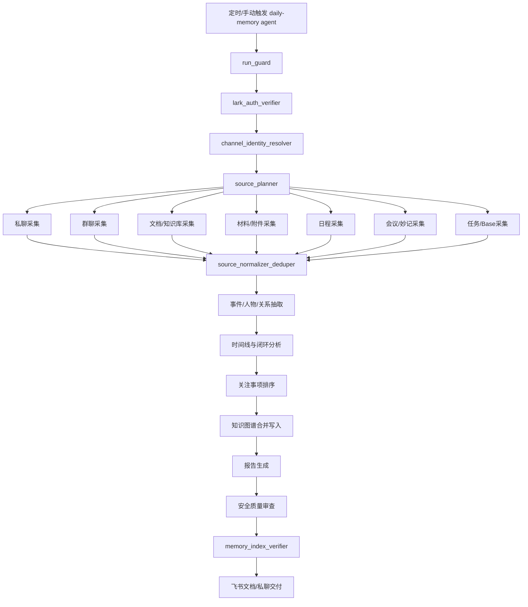

# Daily Memory Skill

`daily-memory-skill` 是一个面向 OpenClaw、Hermes Agent、Codex 及其他智能体平台的个人工作记忆技能。它的目标不是生成普通日报，而是把每天授权范围内的飞书/Lark 私聊、群聊、文档、材料、日程、会议、会议妙记、任务/Base 等信息，整理成可追溯、可更新、可检索的个人事件知识图谱，并把需要关注的事件、风险、进展和闭环状态汇总给用户。

运行时入口是 [SKILL.md](SKILL.md)。本 README 面向人类维护者和自动化安装器，用于理解架构、配置、使用方式和稳定运行注意事项。

## 核心目标

- 构建个人长期项目记忆，而不是一次性的日报摘要。
- 以事件为中心沉淀目标、相关人、时间线、进展、结果、风险、决策、任务和闭环状态。
- 保留每条记忆的证据来源、权限边界、时间戳和可信度。
- 支持 main agent 通过原生 memory search 查询 Daily Memory 的积累。
- 使用动态 subagent 拆分复杂工作流，降低上下文压力，提高稳定性和可恢复性。

## 架构设计



主 agent 只做编排、验收和最终报告。采集、清洗、抽取、合并、审查、发送等步骤由短生命周期 subagent 完成。subagent 不常驻、不拥有长期记忆，只通过 `runs/`、`raw/`、`memory/`、`reports/` 下的结构化产物协作。

## 目录结构

```text
daily-memory-skill/
  SKILL.md
  README.md
  agents/
    openai.yaml
  assets/
    config.example.yaml
  references/
    agent-installation.md
    openclaw-auto-install.md
    hermes-auto-install.md
    lark-cli-ingestion.md
    memory-adapters.md
    safety-quality.md
    schemas.md
    subagent-workflow.md
```

建议的 OpenClaw 运行工作区：

```text
~/.openclaw/workspace-daily-memory/
  MEMORY.md
  runs/YYYY-MM-DD/
  raw/YYYY-MM-DD/
  memory/
    daily/
    graph/
    attention/
    tasks/
    decisions/
    risks/
    people/
    projects/
    daily-memory-YYYY-MM-DD.md
  reports/YYYY-MM-DD.md
```

其中 `memory/*.md` 是给 main agent 检索用的浅层桥接记忆；深层 YAML/JSON 图谱文件是确定性状态源。

## 记忆模型

Daily Memory 使用多层记忆：

- **Raw evidence**：原始消息、文档导出、会议记录、命令输出、采集快照。只作为证据，不直接进入长期记忆。
- **Run ledger**：每次运行的 manifest、角色状态、输入 hash、重试记录、交付状态。
- **Daily memory**：每日观察、事件变化、关键结论和 source refs。
- **Event knowledge graph**：事件、人物、文档、任务、决策、风险、关系边。
- **Reader bridge note**：写在 `memory/*.md` 的紧凑 Markdown，用于 OpenClaw main agent 检索。
- **Native long-term memory**：只保存高置信、长期有用、可复用的规则和偏好。

## 安装方式

自动安装总入口见 [references/agent-installation.md](references/agent-installation.md)。平台细节见：

- [references/openclaw-auto-install.md](references/openclaw-auto-install.md)：OpenClaw 自动安装、daily-memory agent、Feishu channel、cron、main agent memory 检索验证。
- [references/hermes-auto-install.md](references/hermes-auto-install.md)：Hermes 自动安装、外部 Daily Memory 根目录、Hermes native memory 指针、调度与 subagent 编排。

典型安装目标：

```text
~/.agents/skills/daily-memory-skill/
~/.openclaw/skills/daily-memory-skill -> ~/.agents/skills/daily-memory-skill
~/.hermes/skills/daily-memory-skill -> ~/.agents/skills/daily-memory-skill
```

OpenClaw 推荐配置：

- 新建 `daily-memory` agent，workspace 指向 `~/.openclaw/workspace-daily-memory`。
- main agent 通过 `memorySearch.extraPaths` 读取 Daily Memory 的 `memory/` 目录。
- 每晚 `22:00 Asia/Shanghai` 触发 `daily-memory` agent。
- 飞书 channel 的密钥放入 `~/.openclaw/.env`，不要写死在 `openclaw.json`。

## 基础配置

参考 [assets/config.example.yaml](assets/config.example.yaml)。关键配置项：

- `run.schedule`：默认 `0 22 * * *`
- `run.stability.require_lark_auth_verifier`：真实采集前验证 lark-cli 授权
- `run.stability.require_channel_identity_resolver`：发送前解析当前 bot 的 owner peer
- `memory.write_root_bridge_note`：写入浅层 Markdown 桥接记忆
- `memory.verify_reader_search_after_write`：写入后验证 main agent 是否能检索
- `lark.auth_policy.never_login_when_user_token_ready`：user token 可用时禁止误触发重新登录
- `report.delivery.mode`：`file`、`feishu_doc`、`feishu_private_message` 或 `both`

## 使用方式

### 定时运行

在 OpenClaw 中创建 cron job，让 `daily-memory` agent 每天 22:00 执行：

```text
Use $daily-memory-skill to run the Daily Memory nightly archive.
Window: current local date from 00:00 to now.
Timezone: Asia/Shanghai.
Canonical workspace: /home/botinkit/.openclaw/workspace-daily-memory.
```

cron payload 应明确要求：

- 先执行 `run_guard`
- 再执行 `lark_auth_verifier`
- 再执行 `channel_identity_resolver`
- 之后才允许 source collectors 并行采集
- 写入后必须执行 `memory_index_verifier`

### 手动全量回灌

适合首次构建历史知识图谱：

```text
Use $daily-memory-skill to run a historical backfill before 2026-06-10.
Use authorized Feishu/Lark private chats, group chats, calendar, meetings, minutes, docs, materials, tasks/Base when configured.
Clear or isolate previous Daily Memory artifacts only when the user explicitly confirms.
Write graph files, root bridge note, and owner report.
Verify main memory search after indexing.
```

全量回灌应启用分片：

- 消息按 chat 分片。
- 日程按月或季度分片。
- 文档按 token 分片。
- 会议/妙记按时间窗口分片。

### 查询支持

main agent 回答用户问题时，应优先检索 Daily Memory 的 curated memory 和 graph bridge note，而不是直接读取原始私聊全文。只有当用户明确要求追溯证据时，才回到 source refs。

## 飞书/Lark 接入

Daily Memory 默认使用 `lark-cli`：

```bash
lark-cli config strict-mode
lark-cli auth status
lark-cli im +chat-list --as user --types p2p --page-size 3 --format json
lark-cli calendar +agenda --as user --start "$START_ISO" --end "$END_ISO" --format json
```

规则：

- 私聊、个人日程、用户可见文档、用户参与的会议优先使用 `--as user`。
- bot 可见群、bot 发送 owner report 可使用 `--as bot`。
- 如果 `strict-mode` 为 `off`，且 user auth 为 `ready` 或 `needs_refresh`，不要执行 `lark-cli auth login`。
- 每个真实采集 run 必须把 auth 检查结果写入 manifest。
- CLI flag 不确定时先跑 `--help`，不要凭记忆调用。

## OpenClaw Feishu Channel 绑定

OpenClaw 发送 owner report 时，应使用当前 Feishu channel 目录解析出来的 peer：

```bash
openclaw channels status --json
openclaw directory peers list --channel feishu --json
openclaw message send --channel feishu --target "$OPENCLAW_DIRECTORY_PEER_ID" --message "$TEXT" --json
```

不要复用：

- 旧 bot 的 `open_id`
- 其他 app 下拿到的 `open_id`
- 未验证的 `lark-cli` recipient id
- `openclaw.json` 里历史遗留的 binding id

如果出现 cross-app recipient 错误，应重新解析目录 peer，更新 main binding 和 owner allowlist，再重试一次。

### 飞书回复格式建议

如果需要通过 API、`lark-cli im +chat-messages-list`、消息搜索或后续 Daily Memory 回灌稳定读取 bot 回复，建议 OpenClaw Feishu channel 使用普通 `post`/raw 输出，而不是 streaming interactive card：

```json5
{
  channels: {
    feishu: {
      renderMode: "raw",
      streaming: false,
      accounts: {
        default: {
          renderMode: "raw",
          streaming: false
        }
      }
    }
  }
}
```

Streaming 卡片适合实时 UI 体验，但部分 API/CLI 回读只会返回片段或卡片兼容提示，不适合作为可审计交付证据。

## 稳定性策略

- 每次运行都有唯一 `run_id`、窗口、配置 hash 和 source cursor。
- 同一配置下已完成的 run 不重复执行。
- partial run 只重跑失败角色或失败分片。
- 每个 collector 最多重试三次。
- 大范围查询失败时进行确定性分片。
- 单个文档、会议或附件超时不能拖垮整次运行。
- 写 graph 时只追加或生成 conflict，不静默覆盖旧事实。
- 发送前必须经过安全质量审查。
- 第三方通知、Base/任务写回默认禁止，必须用户确认。

## 交付内容

一次成功运行至少应产出：

- `runs/<date>/run_manifest.yaml`
- `raw/<date>/...`
- `memory/daily/<date>.md`
- `memory/*.md` root bridge note
- `memory/graph/...`
- `memory/attention/...`
- `reports/<date>.md`
- 可选：飞书文档、飞书私聊摘要

最终报告应包含：

- 新增/更新/关闭事件
- 事件目标、相关人、开始时间、截止时间
- 进展过程、结果、闭环状态
- 风险、阻塞、待确认问题
- 需要用户关注的事项
- 数据源缺口和低置信项
- memory index/search 验证结果

## 验证清单

安装或升级后建议验证：

```bash
openclaw config validate
openclaw skills info daily-memory-skill --agent daily-memory
openclaw skills check --agent daily-memory
openclaw channels status --json
openclaw directory peers list --channel feishu --json
lark-cli config strict-mode
lark-cli auth status
openclaw memory index --agent daily-memory --force
openclaw memory index --agent main --force
openclaw memory search --agent main "Daily Memory" --max-results 5 --json
```

对 OpenClaw，不能只看 index 命令成功。必须确认 `memory search --agent main` 能命中 `memory/*.md` bridge note。

## 已验证端到端链路

最近一次真实 E2E 验证路径：

1. 飞书用户在当前 bot 私聊发送 `MSR的工作原理`。
2. OpenClaw Feishu gateway 收到消息并路由到 main agent。
3. main agent 调用 `memory_search`，命中 Daily Memory 的 `memory/daily-memory-msr-work-principle.md` 桥接记忆。
4. main agent 调用 `memory_get` 读取桥接记忆全文。
5. main agent 生成带 `Source: Daily Memory Bridge - MSR 工作原理` 的回答。
6. Feishu channel 以普通 `post` 消息发送给用户，并可通过 `lark-cli im +chat-messages-list` 完整回读。

这条链路验证了：

- 新 Feishu bot 绑定成功。
- Feishu channel 可路由到 main agent。
- main agent 可检索 Daily Memory 记忆。
- 检索结果可拼接进最终回答。
- Feishu channel 可把完整内容发送给用户。

## 维护建议

- 保持 `SKILL.md` 精简，把平台安装、subagent 细节、schema 和安全策略放在 `references/`。
- OpenClaw 和 Hermes 共用一个 canonical skill copy，避免多份 skill 漂移。
- Daily Memory graph 是事实源，native memory 只保存桥接摘要和高置信长期规则。
- OpenClaw main agent 读取 Daily Memory 时，优先用 `memorySearch.extraPaths`，不要为了共享记忆把 main workspace 和 daily-memory workspace 合并。
- 每次变更 Feishu bot/app 后，必须重新解析 active channel peer 并跑一次 owner-only E2E。
- 每次变更 memory provider/embedding 配置后，必须强制重建 daily-memory 与 reader agent 的索引，并用 reader agent 查询验证。

## 注意事项

- 这套系统会处理敏感的个人工作数据，必须遵守最小权限和授权边界。
- 原始私聊、群聊、会议记录不应直接写进长期 memory 或 owner report。
- 报告只面向 owner。第三方通知和任务/Base 写回默认禁止。
- 飞书应用切换后，旧 `open_id` 可能跨 app 失效，必须重新解析 OpenClaw directory peer。
- `lark-cli` 的命令和 flag 可能随版本变化，真实运行前要用 `--help` 发现。
- Hermes 内置 memory 较小，不适合存原始证据；应写 pointer 或紧凑摘要。
- OpenClaw main agent 若要读取 Daily Memory，必须配置 `memorySearch.extraPaths` 并重建索引。
- 如果搜索返回空、metadata missing、provider pending 等状态，要记录为平台检索问题，不要宣称记忆可检索。

## 参考文档

- [SKILL.md](SKILL.md)：技能运行时入口。
- [references/agent-installation.md](references/agent-installation.md)：跨平台代理人自动安装总 runbook。
- [references/openclaw-auto-install.md](references/openclaw-auto-install.md)：OpenClaw 自动安装指导。
- [references/hermes-auto-install.md](references/hermes-auto-install.md)：Hermes 自动安装指导。
- [references/subagent-workflow.md](references/subagent-workflow.md)：动态 subagent 编排。
- [references/lark-cli-ingestion.md](references/lark-cli-ingestion.md)：飞书/Lark 数据采集与交付。
- [references/memory-adapters.md](references/memory-adapters.md)：OpenClaw/Hermes/Codex 记忆适配。
- [references/schemas.md](references/schemas.md)：事件图谱与运行产物 schema。
- [references/safety-quality.md](references/safety-quality.md)：安全、隐私、幂等和质量门禁。
